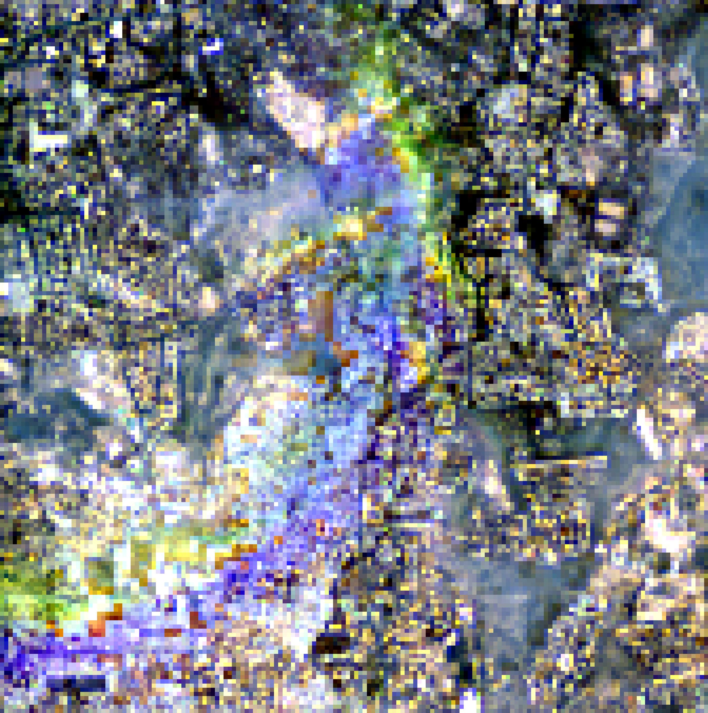
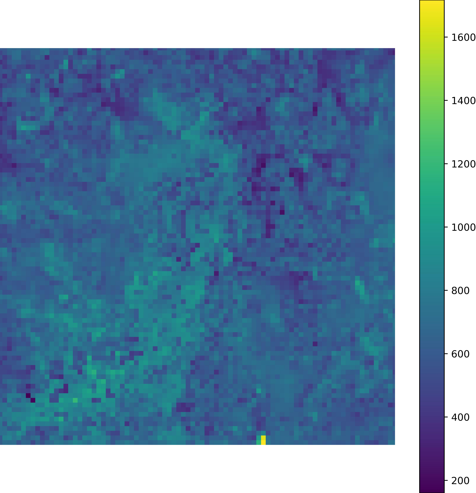
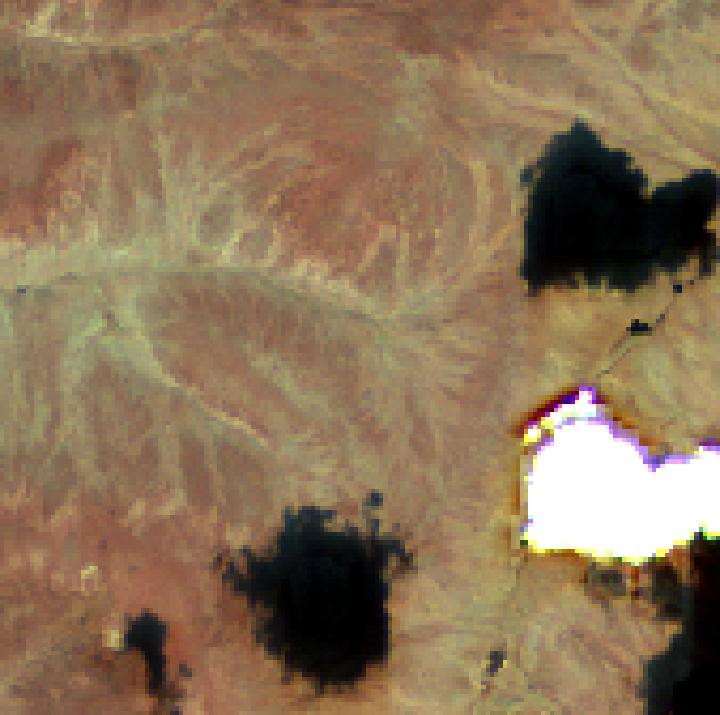
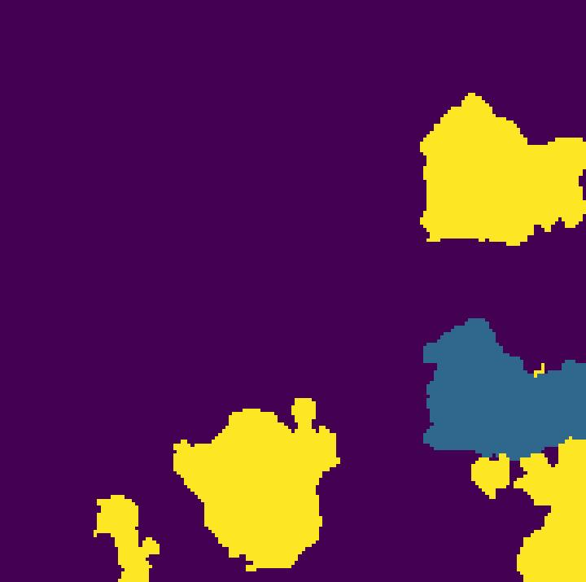
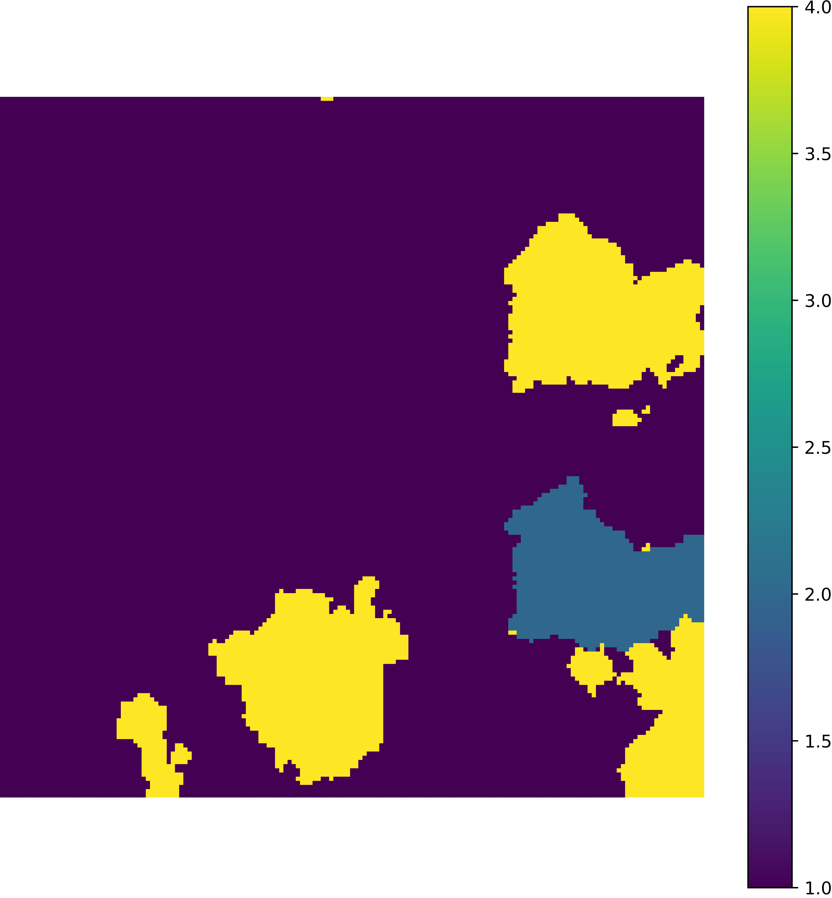

# HLS Swin-Transformer Cloud and Shadow Detection

A deep learning framework for cloud and cloud-shadow detection in Harmonized Landsat Sentinel-2 (HLS) imagery using a Swin-Transformer semantic segmentation model.

The repository includes:

* A pretrained Swin-Transformer model
* Example HLS test imagery and reference labels
* Cloud and shadow prediction script
* RGB visualization utilities
* Example prediction results

---

## Overview

Clouds and cloud shadows are major sources of uncertainty in optical remote sensing applications. This repository provides a Swin-Transformer-based semantic segmentation model trained for cloud and cloud-shadow detection in Harmonized Landsat Sentinel-2 S30 imagery.

The model accepts multi-band HLS imagery and produces pixel-level cloud and shadow masks suitable for:

* Burned area mapping
* Land-cover monitoring
* Change detection
* Vegetation analysis
* Time-series processing
* Earth observation applications

---

## Requirements

TensorFlow 2.7 and Python 3.7.16. 

## Model Files

The pretrained model is a TensorFlow SavedModel:

```text
trained_model/
└── trained_model/
    ├── saved_model.pb
    ├── keras_metadata.pb
    ├── variables/
    └── assets/
```

A compressed archive is provided:

```text
trained_model.tar.gz
```

To extract:

```bash
tar -xzf trained_model.tar.gz
```

---

---

## Using the Model in Python

```python
import tensorflow as tf

model = tf.keras.models.load_model(
    "trained_model/trained_model"
)

prediction = model.predict(input_data)
```

---

## Running Inference

Example:

```bash
python hls_swin_cloud_shadow.py
```

The script loads the pretrained model, reads the input HLS imagery, performs cloud and shadow prediction, and generates output masks.

---


## Example Data

Two example HLS scenes are provided:

### Input Images

```text
test_data/img/
├── img_ROI_0687_20190430T052651_20190430T052819_T43QCA_cloud_hls.tif
└── img_ROI_1245_20200614T013701_20200614T013659_T56WMU_cloud_hls.tif
```

### Reference Labels

```text
test_data/label/
├── label_ROI_0687_20190430T052651_20190430T052819_T43QCA_cloud_hls.tif
└── label_ROI_1245_20200614T013701_20200614T013659_T56WMU_cloud_hls.tif
```

---


## Visualization Utilities

### plot_rgb.py

Creates contrast-enhanced RGB composites from multi-band imagery.

Features:

* Percentile-based stretching
* User-defined RGB bands
* High-resolution export
* Consistent stretching across scenes

### plot_without_border.py

Displays or exports raster images without axes, borders, or extra whitespace.

Features:

* Borderless output
* Optional colorbar support
* High-resolution figure export

---

## Example Results

### Tile T43QCA

#### RGB Composite

```markdown

```

#### Reference Cloud Mask

```markdown

```

It will replicate the examples shown in Figure 8 of the paper https://doi.org/10.1016/j.srs.2025.100213
More test data can be found at https://zenodo.org/records/13910150.

#### Model Prediction

```markdown

```

---

### Tile T56WMU

#### RGB Composite

```markdown

```

#### Reference Cloud Mask

```markdown

```

#### Model Prediction

```markdown

```


## Applications

The model is suitable for:

* HLS preprocessing workflows
* Burned area mapping
* Vegetation monitoring
* Surface reflectance quality control
* Time-series analysis
* Large-scale cloud computing workflows
* HPC processing environments

---

## Citation

# Citation

If you use this work, please cite it as:

```bibtex
@unpublished{swinunet_hls_cloud_shadow_2024,
author = {Haiyan Huang and David P. Roy and Hugo De Lemos and Yuean Qiu and Hankui K. Zhang},
title = {A global Swin-Unet Sentinel-2 surface reflectance-based cloud and cloud shadow detection algorithm for the NASA Harmonized Landsat Sentinel-2 (HLS) dataset},
note = {Manuscript submitted for publication},
year = {2024},
journal = {Science of Remote Sensing}
}

---

## Author

Haiyan Huang

Center for Global Change and Earth Observations
Michigan State University

---

## License

This repository is provided for research and educational purposes.
